# 🛡️ Awesome Public Incident Reporting & Public Safety Software

   

## 📌 Top Incident Reporting (Public Safety) Platforms Ecosystem

**A Curated Ecosystem of Public Safety SaaS Platforms, Law Enforcement Software & Open-Source GitHub Projects**

*Focused on Internal Affairs (IA), Use-of-Force Reporting, Early Intervention Systems (EIS), Police Misconduct Tracking, Case Management & Public Safety Accountability.*

**📅 Last updated: September 2026**

---

### 🔍 Overview & SEO Keywords

This repository tracks notable **SaaS platforms** and **open-source projects** for **Public Safety Incident Reporting, Internal Affairs Case Management, and Police Accountability Software**. These systems empower law enforcement agencies, municipal public safety departments, and oversight bodies to capture, investigate, track, and analyze critical events including use-of-force incidents, citizen complaints, disciplinary records, early intervention warnings, and compliance audits.

**Key Industry Categories Covered:**
- 🚨 **Law Enforcement Internal Affairs (IA) & Professional Standards**
- 📊 **Early Intervention Systems (EIS) & Personnel Performance Tracking**
- ⚖️ **Ethics, Workplace Misconduct & Compliance Investigations**
- 🛡️ **Environmental Health & Safety (EHS) & Operational Risk Management**
- 🔓 **Open Data, Police Misconduct Analytics & Transparency Portals**

---

## 📑 Table of Contents
- [🏢 SaaS/Hosted Platforms](#-saashosted-platforms)
  - [📊 Market Size & Sector Fragmentation Analysis](#-market-size--sector-fragmentation-analysis)
  - [SaaS Products Comparison Table](#saas-products-comparison-table)
- [💻 Open-Source GitHub Projects](#-open-source-github-projects)
- [🤝 How to Contribute](#-how-to-contribute)
- [💖 Support & Sponsorship](#-support--sponsorship)
- [📈 Star History](#-star-history)
- [⚠️ Disclaimer](#%EF%B8%8F-disclaimer)

---

## 🏢 SaaS/Hosted Platforms

### 📊 Market Size & Sector Fragmentation Analysis

> 💡 **Market Size:** The global **Public Safety & Law Enforcement Software Market** is estimated at **$28 Billion to $41 Billion**, growing at a CAGR of **10.5%**. The specialized **Incident Reporting & Internal Affairs Software** niche represents approximately **$2.5 Billion to $4.2 Billion** globally.
>
> 🧩 **Sector Fragmentation:** The sector is **moderately to highly fragmented**. While enterprise EHS and risk suites (e.g., Intelex, Origami Risk) dominate general commercial safety, specialized law enforcement internal affairs software is led by niche category heavyweights (e.g., **Versaterm / IAPro** and **Vector Solutions / Guardian Tracking**). High security, CJIS compliance requirements, and complex government procurement cycles prevent a single "winner-take-all" outcome, allowing multi-product safety suites and specialized IA vendors to co-exist.

### SaaS Products Comparison Table

*Sorted by Estimated Parent Company Size / Revenue (Descending)*

| Product | Description | Company Size / Revenue (Est.) | Pricing | Free Tier Limits |
| :--- | :--- | :--- | :--- | :--- |
| **[Intelex](https://www.intelex.com/)** | Enterprise EHSQ and risk platform offering incident reporting and investigation workflows used in regulated environments. | **~$570M Valuation** ($144M+ Annual Rev / Subsidiary of Industrial Scientific) | Safety Essentials starting at $44–$49/user/month (billed annually, min 25 users); custom enterprise quote | No free tier; free live demo available upon request |
| **[Vector Solutions Guardian Tracking](https://www.vectorsolutions.com/)** | Guardian Tracking capabilities offered within the broader Vector Solutions public safety and eLearning ecosystem. | **~$100M – $500M Revenue** (~1,000–2,000 employees; backed by Genstar & Insight Partners) | Custom quote based on agency size and system modules | No free tier; live product demo available upon request |
| **[Origami Risk](https://www.origamirisk.com/)** | SaaS risk management, claims, and incident reporting platform used across healthcare, corporate, and public sector risk programs. | **~$100M – $189M Revenue** (Backed by Spectrum Equity) | Custom quote based on selected modules (Claims, EHS, GRC) and scope | No free tier or trial; personalized demo available upon request |
| **[Resolver](https://www.resolver.com/)** | Integrated risk, security, and incident management platform supporting investigation workflows (acquired by Kroll). | **~$80M+ Revenue** (Subsidiary of Kroll / ~$36M prior funding) | Custom enterprise quote (typically minimum starting around $10,000/year) | No free tier or trial; live personalized demo available upon request |
| **[IAPro](https://www.ci-technologies.com/)** | Industry-standard internal affairs, BlueTeam incident reporting, and early intervention platform (acquired by Versaterm). | **~$50M – $100M Revenue** (~500–1,000 employees / Versaterm Public Safety) | Custom annual quote (typically starting ~$8,100 initial year / ~$4,500 annual renewal) | No free tier; live demo available upon request |
| **[Case IQ](https://www.caseiq.com/)** | Incident reporting and investigative case management platform used for ethics, compliance, HR, and public sector investigations. | **~$50M – $100M Revenue** (Backed by Resurgens Technology Partners; incl. WhistleBlower Security) | Custom enterprise quote (structured annually per seat + implementation) | No free tier or trial; custom product demo available upon request |
| **[Benchmark Gensuite](https://www.benchmarkgensuite.com/)** | Digital EHS and operational risk platform featuring incident management & compliance workflows. | **~$28M – $50M Revenue** (Backed by Vista Equity Partners) | Custom subscription quote based on enabled apps, sites, and users | No free tier or trial; live product demo available upon request |
| **[PowerDMS](https://www.powerdms.com/)** | Policy management, accreditation, and training compliance platform for public safety (merged with NEOGOV). | **~$20M – $50M Revenue** (Part of NEOGOV Public Sector Suite) | Custom quote based on agency user count and selected modules | No free tier or trial; interactive tour and live demo available |
| **[Guardian Tracking](https://www.guardiantracking.com/)** | Standalone public safety early intervention and employee performance documentation software. | **~$5M – $15M Revenue** (Product line under Vector Solutions) | Starting at $1,200/year | No free-forever plan; 30-day free trial available |
| **[SafeCities](https://www.safecities.com/)** | Public safety operational management and Schedule Express workforce/incident tracking platforms. | **~$5M – $10M Revenue** (Informer Systems) | Custom quote based on agency size and operational requirements | No free tier or trial; free ROI analysis and demo available |

---

## 💻 Open-Source GitHub Projects

*Open-source options for public safety data analysis, incident tracking, emergency response, and police accountability. Repositories are sorted by **GitHub Star Count (Descending)**.*

| Repository | Stars | Description | Focus Area |
| :--- | :--- | :--- | :--- |
| **[cuckoosandbox/cuckoo](https://github.com/cuckoosandbox/cuckoo)** |  | Automated malware analysis and digital forensic investigation sandbox useful for cyber incident response. | Digital Forensics / Cyber Incident Response |
| **[TheHive-Project/TheHive](https://github.com/TheHive-Project/TheHive)** |  | Scalable, open-source Security Incident Response Platform (SIRP) tightly integrated with MISP and case management. | Incident Response & Case Management |
| **[CounterActive/incident-response-plan-template](https://github.com/CounterActive/incident-response-plan-template)** |  | Open framework and templates for building institutional incident response plans and protocols. | Incident Response Templates & Policy |
| **[fivethirtyeight/police-settlements](https://github.com/fivethirtyeight/police-settlements)** |  | Comprehensive open dataset on police misconduct settlements across major US cities (2010–2019). | Police Accountability & Open Data |
| **[openpolicedata/openpolicedata](https://github.com/openpolicedata/openpolicedata)** |  | Centralized Python library providing standardized access to incident-level police data (use of force, complaints, stops). | Public Safety Open Data & Analytics |
| **[codeforamerica/comport](https://github.com/codeforamerica/comport)** |  | Open portal designed to help police departments publish internal affairs and use-of-force data publicly. | Internal Affairs Open Data Portal |
| **[associatedpress/local-ai-brainerd-dispatch](https://github.com/associatedpress/local-ai-brainerd-dispatch)** |  | Prototype Public Safety Reporting System (PSRS) utilizing AI to parse police blotter PDFs for incident extraction. | AI Public Safety Blotter Extraction |

### 🛠️ Key Open-Source Frameworks & Architectural Guidance
- **Data Capture & Intake:** Utilize open form builders (e.g., Form.io, KoboToolbox) or CAD/RMS connectors to ingest public or officer incident reports securely.
- **Investigative Workflow:** Adapt open case management systems (e.g., TheHive, Request Tracker) with specialized schema fields for internal affairs investigations.
- **Analytics & Public Transparency:** Combine Python data pipelines like `openpolicedata` with open dashboards (Metabase, Apache Superset) to publish public accountability metrics.

---

## 🤝 How to Contribute

We welcome contributions from public safety practitioners, software developers, and researchers!

1. 🔀 **Fork** the repository.
2. 📝 **Add or update** entries in `README.md` following our structured tabular format.
3. 🔎 Ensure all links, descriptions, pricing facts, and star badges are accurate.
4. 🚀 **Submit a Pull Request (PR)** with a clear summary of your changes.

Check out [Awesome-Awesome-Awesome](https://github.com/ishandutta2007/Awesome-Awesome-Awesome) for more curated lists!

---

## 💖 Support & Sponsorship

If you find this public safety software index valuable for your research, agency, or open data project:

- ⭐ **Star this repository** to help others discover it!
- 🔀 **Fork & Share** with public safety leaders and accountability researchers.
- ☕ **Buy me a coffee / Sponsor the maintainer**: Support continuous open-source research via [GitHub Sponsors](https://github.com/sponsors/ishandutta2007).

---

## 📈 Star History

---

## ⚠️ Disclaimer

- This is a **community-curated research directory** — not an endorsement or legal assessment.
- Public safety incident and internal affairs platforms manage sensitive personnel records, CJIS data, and legal evidence.
- Any open-source or self-hosted deployment requires strict security, access control, and legal compliance review prior to operational use.

---

<b>🛡️ Built for public safety leaders, professional standards units, and civic accountability teams. Let's make public safety reporting transparent, accurate, and secure!</b>

